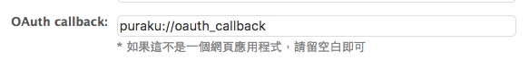

# Puraku 你最愛的噗浪終於登陸 macOS啦！

跟噗浪官方 iOS App 有 87% 像的電腦版噗浪 App！

**還算活躍的開發中，有關專案進度、技術問題或功能建議都可以到 [issue#6][issue-6] 討論**

[issue-6]: https://github.com/puraku/client/issues/6

下載請到 GitHub 的 [Releases 頁面](https://github.com/puraku/app/releases)

## Screentshots


## Development

請確定已經安裝好 node、npm 環境。

1. 開啟終端機，在專案目錄下執行：

    ```bash
    bin/setup
    ```

    此 bash 腳本會幫你安裝 [`yarn`][yarn]，並且把需要的 npm 套件裝好。

2. 接下來請編輯 `app/config.js`，填入你在[噗浪開發者][plurk-developer]申請的 oauth consumer key 和 secret key。要注意的是，在申請 App 時，OAuth callback 需填入：

    ```bash
    puraku://oauth_callback
    ```

    如下圖：

    

3. 最後開啟兩個 Terminal 分別執行以下指令：

    ```bash
    npm run dev          # Terminal 1, webpack Development server

    npm run electron:dev # Terminal 2, start electron
    ```

[yarn]: https://github.com/yarnpkg/yarn
[plurk-developer]: http://www.plurk.com/PlurkApp/

## Directory Structure

```bash
├── app    # electron source
├── bin    # setup scripts
├── docs   # documents and images(if any)
├── src    # Vue.js SPA source
├── static # html template
├── ...
├── ...
└── yarn.lock
```

## Q&A

1. 為毛還要做一個桌面版的 App 呀？不是都有網頁版惹？

    > 我也不知道為什麼 Twiiter 會有那麼多開發者出桌面版 App，可能都是吃飽太閒吧 😅 有 App 是好事啊，代表 API 有人在用耶 XD

2. 選用 Web 技術 Vue.js 有什麼特別的考量嗎？

    > 去年有用過用 React.js + Electon 做的 Twitter App - [Tweetman][tweetman]，體驗並沒有想像中的美好，開發者也沒有後續更新。既然自己號稱 Web Developer ，就來自己幹一個八。選用 Vue.js 原因之一是因為他的簡潔易學，做完這個專案也剛好證明邊做邊學 Vue 是可行的。

[tweetman]: https://tweetman.kksg.net/

## License

MIT
